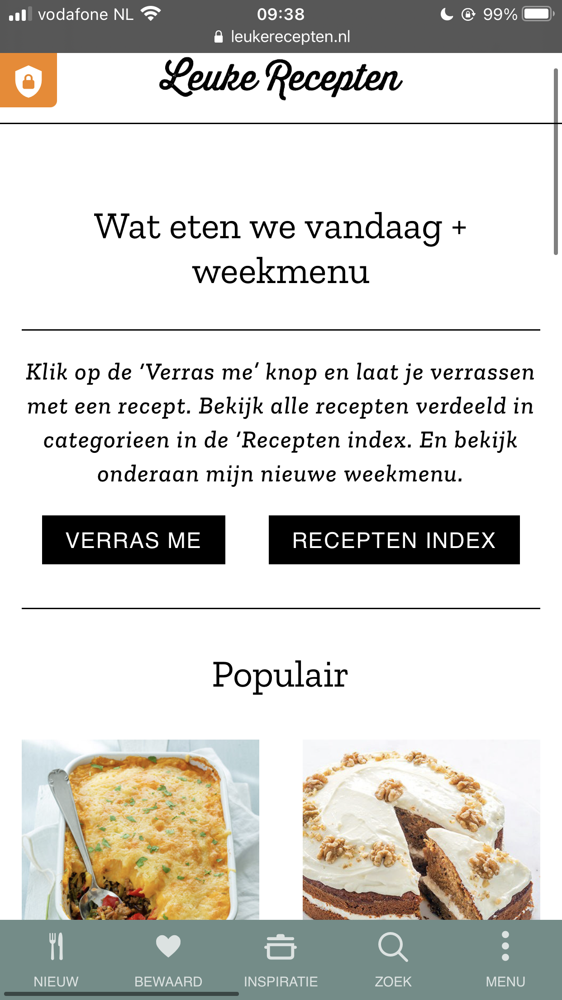

# Procesverslag
**Auteur:** Sarah de Moes

Markdown cheat cheet: [Hulp bij het schrijven van Markdown](https://github.com/adam-p/markdown-here/wiki/Markdown-Cheatsheet). Nb. de standaardstructuur en de spartaanse opmaak zijn helemaal prima. Het gaat om de inhoud van je procesverslag. Besteedt de tijd voor pracht en praal aan je website.

## Bronnenlijst
1. <https://www.leukerecepten.nl>
2. -bron 2-
3. -...-

## Eindgesprek (week 7/8)

-dit ging goed & dit was lastig-

**Screenshot(s):**

-screenshot(s) van je eindresultaat-

## Voortgang 3 (week 6)

-same as voortgang 1-

## Voortgang 2 (week 5)

-same as voortgang 1-

## Voortgang 1 (week 3)

### Stand van zaken

-dit ging goed & dit was lastig-

**Screenshot(s):**

-screenshot(s) van hoe ver je bent met korte uitleg-

### Agenda voor meeting

Susanne Reesink haar agendapunten:

- Ik wil graag weten of ik mijn talen selectie onderin de footer moet maken en hoe?
- Of ik de achtergrond van de kerst banner moet uitwerken?

Susan van de Wiel haar agendapunten:

- Hoe voeg je een eigen lettertype toe? (Ik heb een lettertype dat eindigt op .otf)
- Hoe kun je het beste witruimte oplossen? Is dat alleen te doen met postion:absolute?
- Hoe maak je een uitklapfooter?
- Moet in Github ook de opdrachten komen te staan wat je hebt gemaakt in codepen.io?

Palenque Groot haar agendapunten:

Casper Hamers zijn agendapunten:

Sarah de Moes (ik) haar agendapunten:

- hoe zet ik een hartje op me foto’s en hoe bewerk ik dit goed met Javascript
- Ik twijfel of me site wel goed responsive is, heb ik wel de juiste code gebruikt hiervoor
- Hoe ga ik de tab bar verwerken in me website?
- Hoe stijl ik de dropdown list met de foto’s etc er in op me detailpagina

### Verslag van meeting

-na afloop snel uitkomsten vastleggen-

## Breakdownschets (week 1)

## Intake (week 1)

**Je startniveau:** Blauw/Rood

**Je focus:** Responsive

**Je opdracht:** <https://www.leukerecepten.nl>

**Screenshot(s) van de eerste pagina (small screen):**

**Screenshot(s) van de tweede pagina (small screen):**

