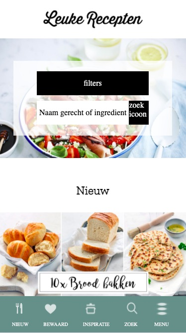
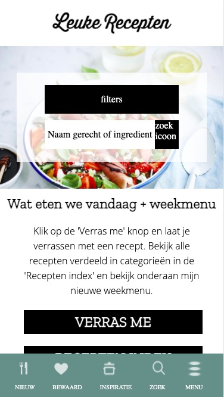
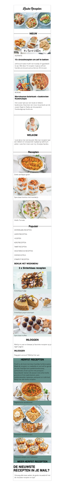

# Procesverslag
**Auteur:** Sarah de Moes

Markdown cheat cheet: [Hulp bij het schrijven van Markdown](https://github.com/adam-p/markdown-here/wiki/Markdown-Cheatsheet). Nb. de standaardstructuur en de spartaanse opmaak zijn helemaal prima. Het gaat om de inhoud van je procesverslag. Besteedt de tijd voor pracht en praal aan je website.

## Bronnenlijst
1. <https://www.leukerecepten.nl>
2. <https://www.w3schools.com/howto/howto_css_style_hr.asp>
3. <https://www.handleidinghtml.nl/css/eigenschappen/color/voorbeelden.html>
4. <https://css-tricks.com/line-on-sides-headers/>

## Eindgesprek (week 7/8)

-dit ging goed & dit was lastig-

**Screenshot(s):**

-screenshot(s) van je eindresultaat-

## Voortgang 3 (week 6)

-same as voortgang 1-

## Voortgang 2 (week 5)

<b> Dit ging er goed </b>

Het is me goed gelukt om een tabbar toe te voegen aan me pagina en die ook sticky blijft. Daarnaast is het me met een beetje hulp van een klasgenoot ook gelukt om een transparante box te maken over de foto in de header. Dit moet alleen nog een beetje gestyled worden. Me website is nu bijna helemaal klaar op een paar CSS dingetjes nog.

<b> Dit ging er minder goed </b>

Ik loop nog steeds vast met het element ::before en ::after waar ik de lijnen mee kan maken voor me website. Ik heb hier extra hulp bij nodig. Daarnaast heb ik problemen met de dropdown box van de detailpagina.

- ::before & ::after gebruiken voor een lijn
- Dropdownbox op de detailpagina
- De website volledig responsive maken

**Screenshot(s):

<b> Uitleg </b>

Alle basis HTML heb ik nu verwerkt in de website. Ik zit nu denk ik op 70 a 80% CSS wat ik verwerkt heb. De HTML ging me best goed en snel af, CSS heb ik wat meer tijd voor nodig maar met hulp kom ik er wel uit.

### Agenda voor meeting

Palenque Groot haar agendapunten:

- Hoe zorg ik er voor dat me menubar sticky wordt.
- hoe zorg ik er voor dat je niet kan scrollen als me menu open staat.
- Hoe maak ik me button bewegend.
- moet ik die flash img aanpassen?

Suzanne Reesink haar angedapunten:

- Weten hoe ik mijn carousel moet maken?
- Hoe ik bij 'waarom sonos' de afbeeldingen over elkaar moet plaatsen en positioneren?
- Hoe ik bij 'waarom sonons' die underline kleiner maak?
- Hoeveel 'kopjes' ik bij de nieuws pagina moet maken?
- Hoe krijg ik bij kerst mijn achtergrond img?

Susan van der Wiel haar agendapunten:

-Hoe los ik de witruimte op (nergens zit een grote width, height, margin of padding op)
-Hoe stijl ik de footer? Op internet staan alleen maar moeilijke dingen
-Hoe maak ik de functieloze groene balk onder de foto (en hoe gaat deze responsive mee?)
-Hoeveel classes mag je meegeven? Ik heb er nu 1 op de main van de detailpagina, mag dat wel?

Sarah de Moes (ik) haar agendapunten:

- Hoe gebruik ik de ::before goed voor de strepen
- Hoe maak ik me tabbar sticky
- Hoe fix ik me tabbar goed
- Hoe maak ik de dropdown zoals op de website

## Voortgang 1 (week 3)

### Stand van zaken

<b> Dit ging er goed </b>

Ik zag er een beetje tegenop dat ik weer moest coderen omdat het coderen me in het eerste jaar niet zo goed af ging. Het duurde heel lang voor mij om het eindelijk door te hebben en om iets leuks in elkaar te zetten. Toen ik ben begonnen met de site bleek ik het toch sneller op te pakken dan ik had verwacht van mezelf. Ik vond dit een grote tegenvaller en vind het coderen zelfs leuker nu.

<b> Dit ging er minder goed </b>

De website heeft bepaalde elementen wat ik nog niet helemaal begrijp. De nieuwe elementen die we nu geleerd hebben met code pen kan ik ook nog niet heel goed plaatsen in me website. Hier val ik weer terug in me eerste jaar (nieuwe begrippen duren voor mij gewoon langer om te begrijpen). Code pen helpt mij overigens wel erg om het beter en sneller te begrijpen. Met deze elementen liep ik vast tijdens me eerste proces:

- HR elementen waar ik tekst overheen moest plaatsen
- De tab bar van de website
- De website volledig responsive maken

**Screenshot(s):

<b> Uitleg </b>

Alle basis HTML heb ik nu verwerkt in de website. Ik zit nu denk ik op 40 a 50% CSS wat ik verwerkt heb. De HTML ging me best goed en snel af, CSS heb ik wat meer tijd voor nodig maar met hulp kom ik er wel uit.

### Agenda voor meeting

Suzanne Reesink haar agendapunten:

- Ik wil graag weten of ik mijn talen selectie onderin de footer moet maken en hoe?
- Of ik de achtergrond van de kerst banner moet uitwerken?

Susan van de Wiel haar agendapunten:

- Hoe voeg je een eigen lettertype toe? (Ik heb een lettertype dat eindigt op .otf)
- Hoe kun je het beste witruimte oplossen? Is dat alleen te doen met postion:absolute?
- Hoe maak je een uitklapfooter?
- Moet in Github ook de opdrachten komen te staan wat je hebt gemaakt in codepen.io?

Palenque Groot haar agendapunten:

- Moet ik de carousel/slider/button maken met gewoon css?
- Moet ik de foto’s van insta “life” er in zetten?
- Moeten de links binnen je eigen website terug linken naar de andere pagina?

Casper Hamers zijn agendapunten:

Sarah de Moes (ik) haar agendapunten:

- hoe zet ik een hartje op me foto’s en hoe bewerk ik dit goed met Javascript
- Ik twijfel of me site wel goed responsive is, heb ik wel de juiste code gebruikt hiervoor
- Hoe ga ik de tab bar verwerken in me website?
- Hoe stijl ik de dropdown list met de foto’s etc er in op me detailpagina

### Verslag van meeting

Meer pseudo paden toevoegen uiteindelijk, maar ik mag beginnen met het helemaal stijlen met classes. Voor de HR lijn moet ik even kijken naar ::before en ::after -> <https://css-tricks.com/line-on-sides-headers/>.

## Breakdownschets (week 1)

## Intake (week 1)

**Je startniveau:** Blauw/Rood

**Je focus:** Responsive

**Je opdracht:** <https://www.leukerecepten.nl>

**Screenshot(s) van de eerste pagina (small screen):**

**Screenshot(s) van de tweede pagina (small screen):**

